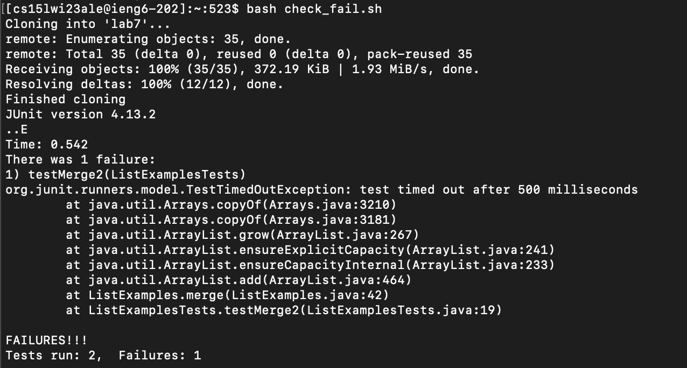
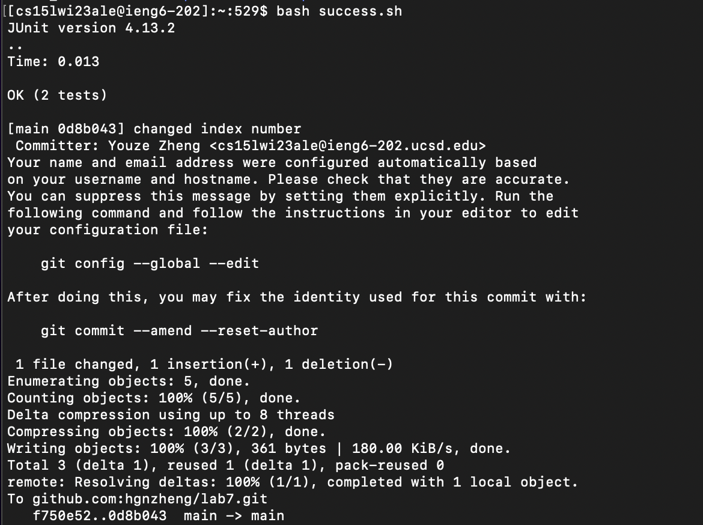

Name: Hargen Zheng\
PID: A17383701\
Sources: My own Lab Report 4 and Week 7 Lab Tasks Writeup

Lab Session: Wednesday 11:00 - 12:50 @EBU3B_B270

# Lab Report 5
*Welcome to my lab report 5 webpage. In this lab report, we will go in-depth about how to improve our performance on the lab task demonstrated in lab report 4. More specifically, I will try to write a bash script so we can "cheat" on the competition and win Joe's certificate!*

Last time I talked about the detailed steps to complete the lab tasks. However, I have heard that one person finished all the tasks within ten seconds. I did not believe it until I knew that he used bash script that included all the commands. Therefore, he only needed to type in the command to run the bash script and he was done with the tasks! That's smart and I have always wanted to try myself. Therefore, in this lab report, let's reproduce that guy's work -- to use bash script to run all the command we need to finish the lab tasks. 

Hope you would enjoy reading my report. Let's get started!

# Task settings
Before we write the bash script, let's log into `ieng6` remote server so that we can work on the remote computer. The detailed description of how to log into remote server was included in my lab report 4.

We want to write a bash script that contains all the command we need to complete the lab tasks 4-9. Since I cannot find a way to modify `.java` file using bash, I would create two `.sh` files to complete the tasks. Though it may take more time than just using one bash file if there is a way to modify `.java` file using bash, this method still optimizes our completion time by a lot.

# Bash script 1: `check_fail.sh`
Let's write the bash script for the fifth step -- *clone your fork of the repository from your Github account* -- first. Assume we have already forked the repository, we need to delete the repository that we have clone before, if there are any, using the bash command `rm -rf lab7` because the cloned repository is named `lab7`. Then, we need to clone the repository again using the command `git clone git@github.com:hgnzheng/lab7.git`. We are using SSH clone so that we can conveniently push the changes to Github. These are the same commands we would use in terminal. After cloning, let's change to working directory by `cd lab7`, and we are done with the first part.

Then, we move forward to the sixth step of the lab task -- *run the tests, demonstrating that they fail*. To compile the `.java` files and JUnit test files, we use the command ` javac -cp .:lib/hamcrest-core-1.3.jar:lib/junit-4.13.2.jar *.java`. Then, we run the test file by typing `java -cp .:lib/hamcrest-core-1.3.jar:lib/junit-4.13.2.jar org.junit.runner.JUnitCore TestListExamples`. Since I'm on MacOS system, I am using the mac command instead of the Windows one, so this command may be slightly different from the one you are used to.


Finally, we can run the command `bash check_fail.sh`. Now we should see that one test fails and we have completed the fifth step of the lab task, as shown in the screenshot below:
 

Here is a complete content for `check_fail.sh` file.
```ruby
rm -rf lab7

git clone git@github.com:hgnzheng/lab7.git
echo 'Finished cloning'

cd lab7

javac -cp .:lib/hamcrest-core-1.3.jar:lib/junit-4.13.2.jar *.java
java -cp .:lib/hamcrest-core-1.3.jar:lib/junit-4.13.2.jar org.junit.runner.JUnitCore ListExamplesTests
```

# Code correction
Same as what I described in the last lab report, I use `vim` to correct the code. Now, our program should work well. The basic idea here is to change the working directory to `lab7` and use `vim` to modify the buggy code. Then we are done with this step. 

# Bash script 2: `success.sh`
Now we have cloned the repository and corrected the code, we need to take the minimum amount of time to demonstrate that all JUnit tests pass. Here, we write another bash script to achieve this goal.

We first change our working directory to `lab7`. We compile all the files again and run the test in this bash script, which are the exact same commands we used in `check_fail.sh`. 

Then, we need to push the changes to Github by  the commands `git add ListExamples.java`, `git commit -m "changed index number"`, and `git push`.

By running the command `bash success.sh`, we can show that all tests have passed and we have successfully pushed the changes to Github, as shown in the screenshot below:


I was not prompted to enter any account number and password because I have generated an SSH key for Github during Week 7 lab, so I can directly push my changes to my Github account on remote server.

Here is the full content of my bash script for `success.sh`
```ruby
cd lab7

javac -cp .:lib/hamcrest-core-1.3.jar:lib/junit-4.13.2.jar *.java
java -cp .:lib/hamcrest-core-1.3.jar:lib/junit-4.13.2.jar org.junit.runner.JUnitCore ListExamplesTests

git add ListExamples.java
git commit -m "changed index number"
git push
```

Though it seems I am still taking much time to finish the tasks, the timing is much improved for me. With all these bash files written beforehand, I was able to finish all lab tasks within 15 seconds -- a much improvement compared with my 69 second without using bash.

---

I have demonstrated, for each step, the methods and commands I have used to finish the tasks using bash command. The good thing is that finishing lab tasks now takes less time. However, there are much more behind scene work such as writing the bash scripts and generating SSH key to connect to Github -- otherwise the push may take more time.

But anyway, I have used another approach to finish the lab tasks and saved some time, which achieved my goal! 

A little reflection: I really enjoyed CSE 15L labs and writing these lab reports. I have learned how to write bash, code web server, and identify failure-inducing input, etc. Really enjoyed the course and appreciate teaching stuffs' efforts to make this course possible. Thank you so much for all the work you have put for this course. Almost time to say goodbye; Good luck with your future quarters at UC San Diego and with your career as well! 

---
This is the end of Lab Report 5.\
Best wishes,\
Hargen Zheng

