Name: Hargen Zheng\
PID: A17383701\
Sources: [Week 7 Lab Writeup](https://ucsd-cse15l-w23.github.io/week/week7/)

Lab Session: Wednesday 11:00 - 12:50 @EBU3B_B270

# Lab Report 4
Welcome to my lab report 4 webpage. In this lab report, we will walk through the competition that was held during Week 7's scheduled lab time. Also, I will include a screenshot of each numbered step, with short descriptions follows afterward. Without further due, let's start the lab report!

# Step 1. *Setup* Delete any existing forks of the repository I have on my account.

Before doing anything, I have forked the `lab7` repository during my lab time. Therefore, I have to delete at first. Here is a screenshot of my fork.
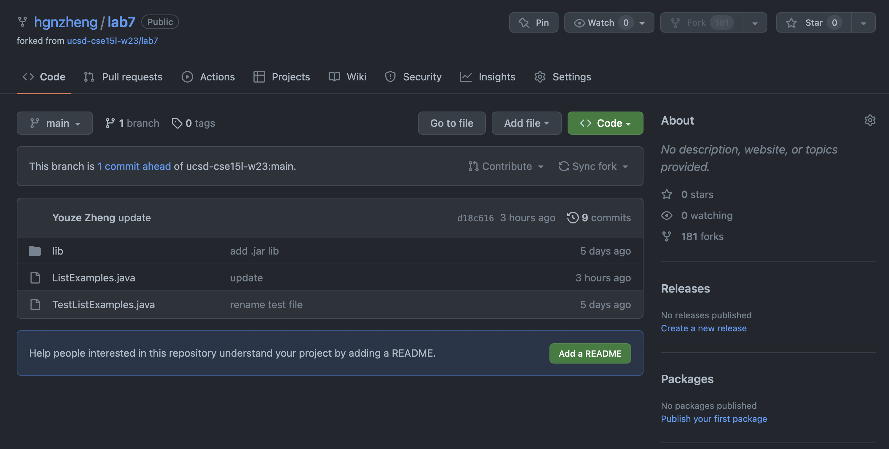

To delete the fork, we need to go to the "Settings" in the function bar and scroll all the way down to the "Danger Zone" section, as shown in the screenshot below:
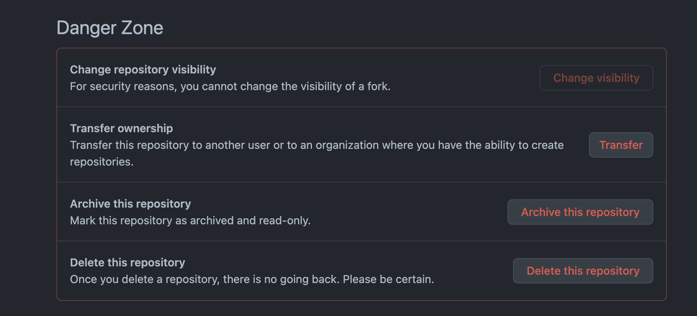

Now, we can click the button "Delete this repository." After following the instruction given by Github, we would successfully delete the repository that we forked.  

# Step 2. *Setup* Fork the repository.
Since we have deleted the repository that we forked before, we want to fork the repository again to test the code and do modifications as we want. To fork the repository, we go the [lab7 repo](https://ucsd-cse15l-w23.github.io/week/week7/) as shown below, and click the button "Fork" to create a fork.
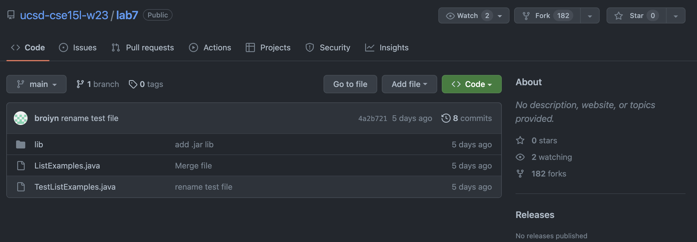

After the fork, we are redirected to a similar page, but notice that there is a minor change to the Github webpage, as shown below:
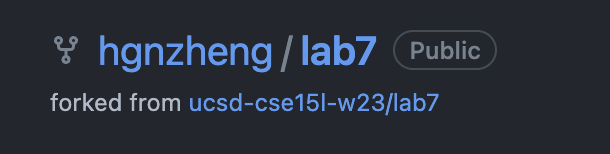

We can now see my Github Username and there is a smaller text saying "forked from `ucsd-cse15l-w23/lab7`," which indicates that this is not a repository we made, but rather one that we forked from another user. This also tells us that we have forked the repository successfully and have completed the second step.

# Step 3. Start the timer.
There are many options for this step, such as using a physical stopwatch or using the built-in stopwatch in a phone. However, for the demonstration purpose, I will show how to use an online stopwatch to time for the following steps. We can go to the website [Online Stopwatch](https://www.timeanddate.com/stopwatch/) and use it to time ourselves. The webpage should look like the screenshot below:
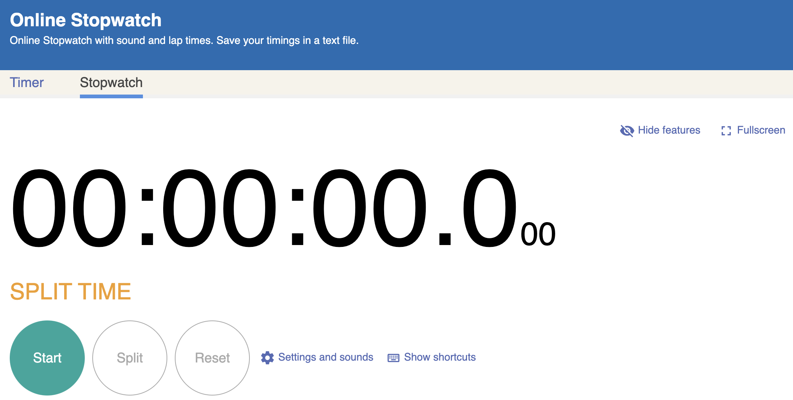

# Step 4. Log into `ieng6` remote server.
Now we have done all the preparations and the stopwatch is running. We need to open our terminal and log into the `ieng6` remote server to do the rest of the work.

I typed `ssh cs15lwi23ale@ieng6.ucsd.edu` and then entered my password, and I am logged into the remote server. Note: I still need to type my password perhaps because I did not configure `ssh-keygen` on my own computer. I did not need to type the password after configuration in the lab computer. Here is a screenshot of my terminal showing I am logged into `ieng6`:
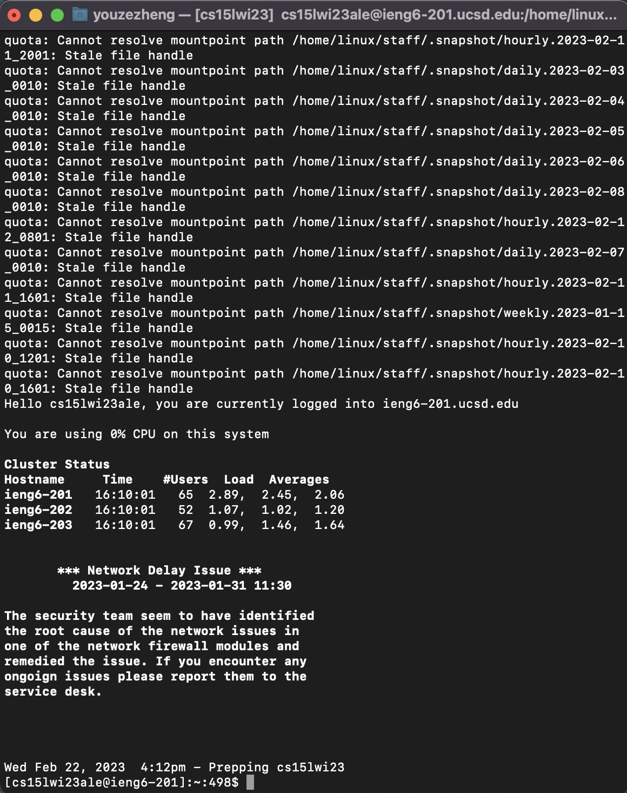

# Step 5. Clone my fork of the repository from my Github account.
Now we are logged in. We copy the link 

We can use `git clone` to clone the repository we just forked, with the `ssh` clone URL copied from the screenshot below:
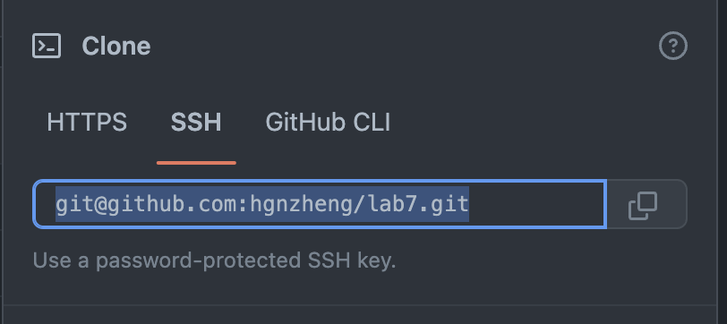

The full command is `git clone git@github.com:hgnzheng/lab7.git`. After several seconds, we can see from the terminal that the clone is successful:
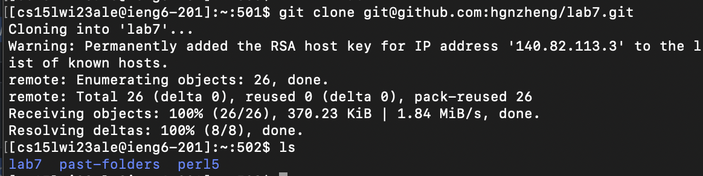

# Step 6. Run the tests, demonstrating that they fail.
Before actually running the test, we need to run the command `cd lab7` to change our working directory from home to the directory we just cloned. To run the tests, we need to compile the JUnit tests first and then run the test file. Here, we use the command `Ctrl-R` to search for the compile command we have run during lab, since I believe it is faster than using `<up>` to search one by one. After typing `Ctrl-R *` in terminal, I see the command I want as shown in the screenshot below:
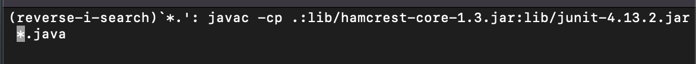

After hitting `Enter`, we have successfully compiled the JUnit. Then, we want to run the test file to see the test that is supposed to fail. 

Again, we take advantage of the search command to search faster. This time, I used `Ctrl-R junit <up>` and got the command `java -cp .:lib/hamcrest-core-1.3.jar:lib/junit-4.13.2.jar org.junit.runner.JUnitCore TestListExamples`. After hitting `Enter`, we see that the `testMerge2` fails. 
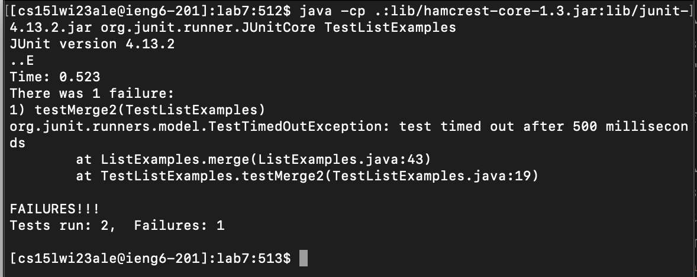

# Step 7. Edit the code file to fix the failing test.
To identify the bug, we want to open the `ListExamples.java` file. Though I was introduced to `nano` on Wednesday's lecture, I personally prefer to use `vim`. Therefore, I would show how to use `vim` to open and edit the file. 

In the terminal, we type `vim ListExamples.java` and hit `Enter`. Now, `vim` takes over the terminal like the screenshot below:
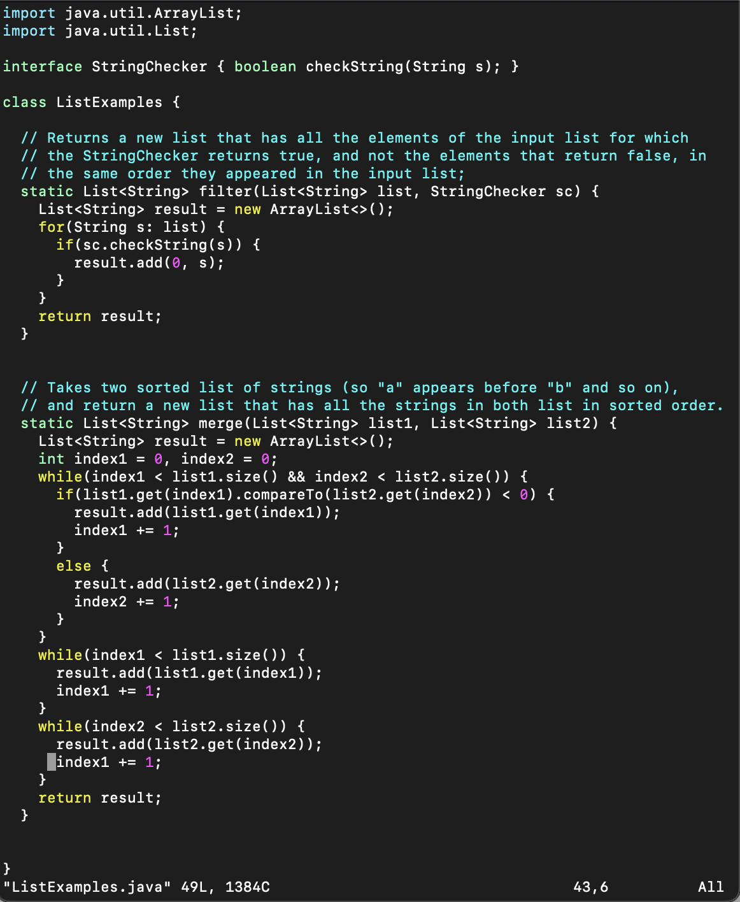

We hit `j` key to move our cursor down until the merge method. We easily see that in the last while loop, the incremented index should be `index2` instead of `index1`. We hit `l` key until our cursor is right to `index1` as shown below:
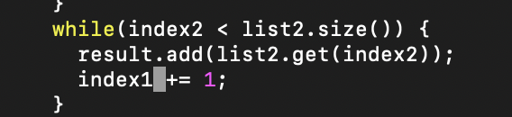

Then, we hit `i` to enter insert mode and hit `delete` to delete the number `1` and type `2` to change `index1` to `index2`. After that, we hit `esc` to exit insert mode. By entering the command `:wq`, we save the change and quit the file we are editing, and we are back to the "familiar" terminal again.

# Step 8. Run the tests, demonstrating that they now succeed.

Same as what we did in step 6, we run both commands again and would see the following result:
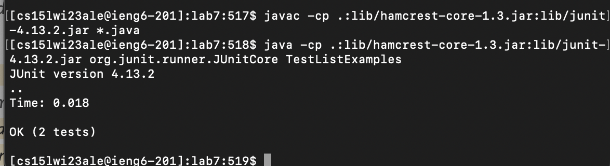

After the change, both two tests succeed and we are good to commit and push our change to the Github.
# Step 9. Commit and push the resulting change to my Github account.
Before committing, we need to add the change to Github using command `git add ListExamples.java`. There is nothing showing in the command line. 

After that, we type `git commit -m "changed index number` to commit the change with a message summarizing our change. Here is a screenshot of the terminal after entering the command:
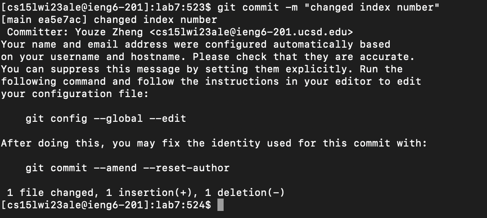

Lastly, we want to push our change to the Github by typing `git push`. Then, we can see the terminal as follows and we are done with the push:
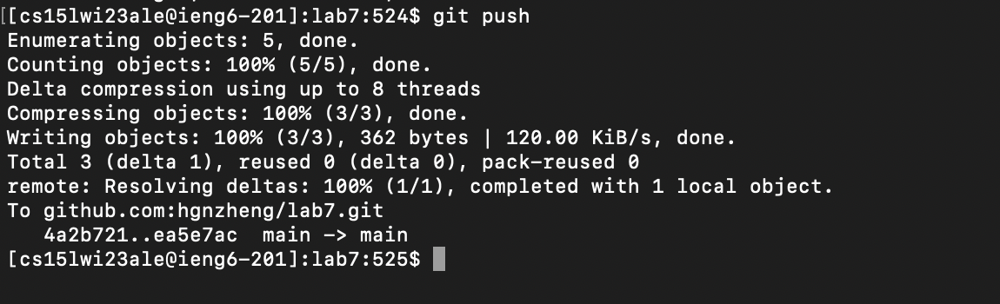

And we are done with all the steps.

---

I have demonstrated, for each step, the methods and commands I have used to finish the tasks during the lab. 

This is the end of Lab Report 4.\
Hargen Zheng

