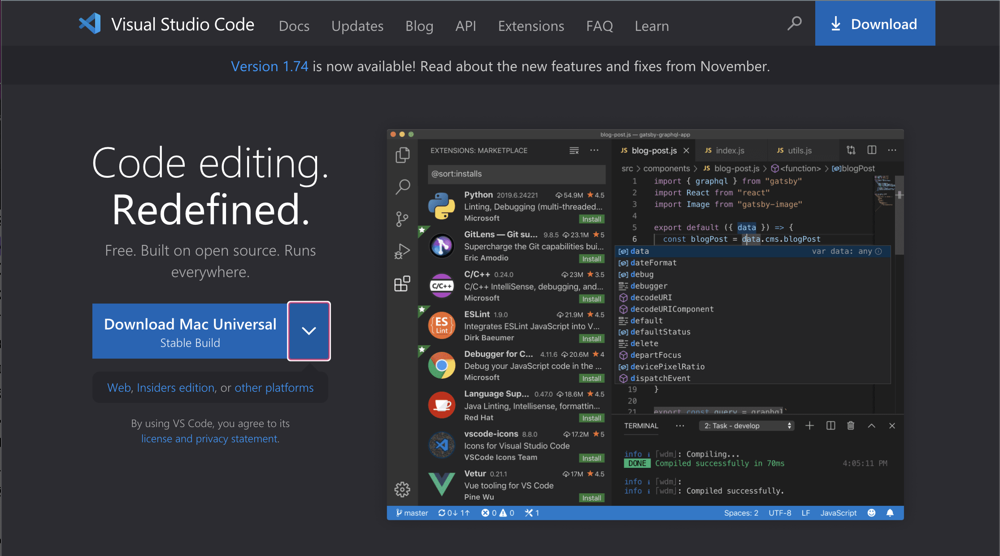
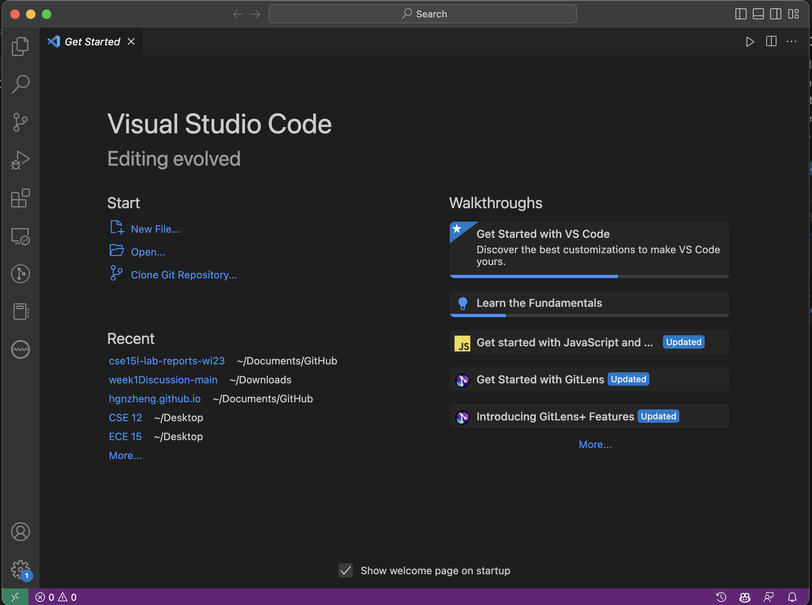
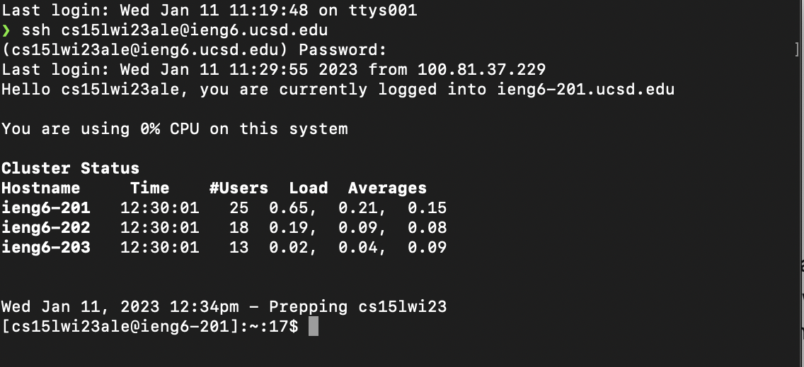
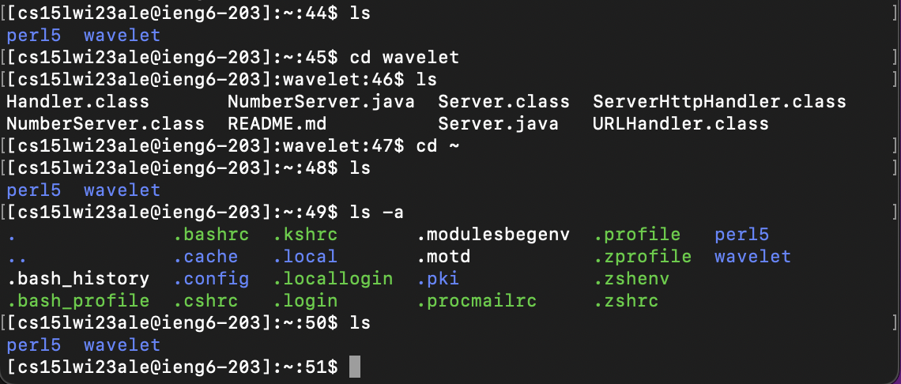

Hargen Zheng, Wednesday 11:00 - 12:50 at EBU3B B270

# Week 1 Lab on January 11th 
Today's lab consists of three major components:
* Installing Visual Studio Code in several clicks.
* Following "simple" step to remotely connect to your ieng account that CSE department gives you!
* Trying Some Commands to get familiar with the tools we are going to use throughout the quarter.
# Installing Visual Studio Code
Under this section, we are going to give a step by step instruction for you to successfully install Visual Studio Code (we will refer this as VSCode in later parts of this lab report). 
## Step 1: Go to the right place to download the right VSCode
Go to the official VSCode website to install the application: [VSCode Website](https://code.visualstudio.com/). 

After clicking the hyperlink, you should be able to see the webpage similar to the screenshot below:

If yes, you are good so far. If you are not seeing this page and see something like 404,sorry. Check your internet connection and click the link again. If it is still not working, contact UC San Diego IT Support at (858) 246-4357.

## Step 2: Download the VSCode package
By far, you have gotten to the right place to download the VSCode. You are just a couple of click away from finishing the installation process. 
Let's click on the blue button, as shown in my screenshot above. Don't worry. The VSCode website is intelligent enough to recognize your computer operation system, so there is no need for you to switch a different package to install. Just click the blue button; the VSCode package will get installed to your automatically. If you are connected to the internet, the installation should complete within a few minutes. 

## Step 3: Install VSCode to your computer
Now you have successfully downloaded the installation package to your computer. Click on the package and follow the instruction to get VSCode downloaded to your computer! Once the installation process is complete, open the application; you should see a similar app interface like the screenshot below:

## Conclusion
Cool. You have finished the very first step of this lab by successfully installing the VSCode to your own computer. **Congratulations!** Please follow along with the second component of the lab to set up your CSE 15L account for future course uses.

# Remotely Connecting

## Step 1: Set up CSE 15L course specific account
If you have completed any computer sciences classes with lab components at UC San Diego, you should probably know how to set up your course specific account. If that's you, please feel free to skip this section and move on to the next section.

If you have never done this before, here are the instructions for you to smoothly set up your CSE 15L course account. It takes some time; please be patient with the whole process.

Firstly, go to UC San Diego Account Loopup website [Link](https://sdacs.ucsd.edu/~icc/index.php) to check your CSE 15L specific account user name. Please input your *Username* and *Student ID, aka PID* to access your account information. Besides the username for your tritonlink login, you should see a section called **Additional Accounts** where you can see a grey button containing your CSE 15L username! The format of the username is simple enough to recognize: "cs15l" (the course name) + "wi23" (the quarter you are taking the course) + "abc" (just some random letters). Click on the button and follow along to reset your password. If you need any further instruction, please click the link [How-to-reset-your-password](https://sdacs.ucsd.edu/~icc/index.php) and follow the more detailed instructions here!

Once you have completed the reset process, wait for about an hour for the new password to become effective. After that, please go to the next steps to remotely connect to a lab computer.

## Step 2 (Windows Only): Git Installation
If you are using Mac/Linux operation system, you can skip this step and move on to step 3. For Windows users, we have to install *git* before we are able to connect remotely. Please click the link [Git for Windows](https://gitforwindows.org/) to download git. Once you have completed the installation, follow along with the steps detailed on [stack overflow](https://stackoverflow.com/questions/42606837/how-do-i-use-bash-on-windows-from-the-visual-studio-code-integrated-terminal/50527994#50527994) to set your default terminal for *git*.

## Step 3: Remote Connecting
As of now, Windows, Mac, Linux users are all on the same page. Please open the terminal in VSCode, or your system built-in terminal.

Type in command `ssh <your CSE 15L username>@ieng6.ucsd.edu`. For example, my username is *cse15lwi23ale*, so I input `ssh cse15lwi23ale@ieng6.ucsd.edu`. Press enter. If you entered the correct command, you will be prompted to enter your password. The password is just the one you reset in the first component of this lab. If you have waited long enough for your reset password to become effective, you should see a bunch of commands popping up to connect you with a lab computer, as follows:

Some first-time users may have been prompted to answer `Are you sure you want to continue connecting (yes/no/[fingerprint])?` before entering the password. You need to type `yes` and press enter unless your have a specific reason not to do so. After that, you should be successfully connected to the remote lab computer. 

# Running some basic commands
**Congratulations!** You have completed most part of this lab. This third component is for you to test some basic terminal commands that you will use throughout the quarter. This section is intended to provide you with some basic examples of command you can run. Surely, you can test out as many other commands as you like. 

Here are some useful commands to try [cse15-week1]:
* `cd ~`
* `cd`
* `ls -lat`
* `ls -a`
* `ls /home/linux/ieng6/cse15lwi23abc/`, where abc is the unique letters at the end of your username.
* `cp /home/linux/ieng6/cse15lwi23/public/hello.txt ~/`
* `cat /home/linux/ieng6/cse15lwi23/public/hello.txt`
* ...

I noticed that the command `cd`, which could mean change directory, is very useful in the sense that it helps user to navigate from one directory to another one. The command `cd ~` enables me to go back to the home directory -- another useful one here. `cp` is used for copying files, which people do often times. Above, I loved how the command `ls` provides information about what is my current directory, so I known the next steps to navigate to my target directory.

By testing these commands, you should see something like the screenshot below:

# Ending Note
**Congratulations!** You have completed all three components of this lab. You are to use these tools to learn more computer science as the quarter goes!

