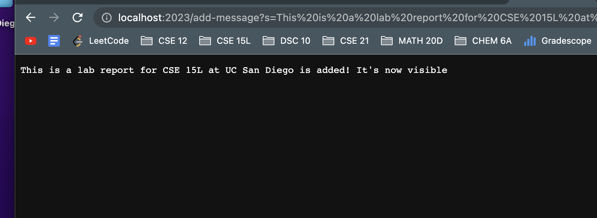
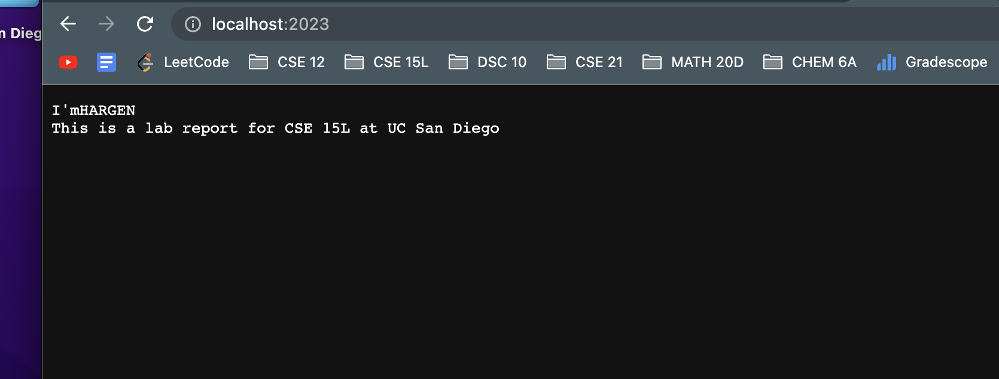

Name: Hargen Zheng\
PID: A17383701\
Sources: Week 2 Lab 'NumberServer.java', 'Handler.class', ad 'URLHandler.class' files.\
Lab Session: Wednesday 11:00 - 12:50 @EBU3B_B270

# Lab Report 2 
Welcome to my lab report 2 webpage. In this lab report, I have included the details of my implementation to create a simple web server called StringServer; description of bug fixes from the Week 3 lab; and a reflection of what I have learned from previous two weeks of labs. Let's first dive into the first part -- creating a web server from "scratch."

# Part 1: Web server: StringServer

> My code Implementation

```ruby
import java.io.IOException;
import java.net.URI;
import java.lang.StringBuilder;

class Handler implements URLHandler {
    StringBuilder str = new StringBuilder();
    public String handleRequest(URI url) {
        if (url.getPath().equals("/")) {
            return String.format("%s", str);
        } else {
            System.out.println("Path: " + url.getPath());
            if (url.getPath().contains("/add-message")) {
                String[] parameters = url.getQuery().split("=");
                if (parameters[0].equals("s")) {
                    StringBuilder result = new StringBuilder();
                    for(int i = 1; i < parameters.length; i++){
                        result.append(parameters[i]);
                    }
                    str.append(result + "\n");
                    return String.format("%s is added! It's now visible", result); 
                }
                return null; 
            }
            }
            return "404 Not Found!";
        }
    }

class StringServer {
    public static void main(String[] args) throws IOException {
        if(args.length == 0){
            System.out.println("Missing port number! Try any number between 1024 to 49151");
            return;
        }

        int port = Integer.parseInt(args[0]);

        Server.start(port, new Handler());
    }
}
```

To show the results of adding messages, I opened up my web server with port number 2023. The web server initially does not contain anything, as shown in the screenshot below:
 
As we have our code and web server ready, we can now test our server against the intended implementation requirements -- to add string messages.
+ The 'parseInt' method is called as well to convert our input port number to its corresponding numerical value, as Java does not read in numbers.
+ 'Server.start' is called as well to start our server here, with arguments of my port number and a Handler that process my requests. Now, I am able to view the web server locally in my computer.

> Screenshot one of my StringServer

For the first message, I wanted to add I'mHARGEN, which does not have an empty space in between words. Adding this way, we can test the simplest implementation of our code -- to add a string without space(s). When I typed `add-message?s=I'mHARGEN`, we can see that a message pops up, and that message tells us "I'mHARGEN is added! It's now visible." 
+ This is exactly what we wanted because we expect to see a message that says "xx is added! It's now visible," as in our code `return String.format("%s is added! It's now visible", result);`.
+ Above all, the method 'handleRequest' is called with the URL address that runs in our local machine to check against our path and return specific results as specified in our code. 
+ Since this is the first time we use the query `add-message`, a StringBuilder object called 'result' is initialized to store the message "I'mHARGEN," which will later be appended to the "str" StringBuilder object.


+  After adding the message to the intermediate variable 'result,' the content in that variable is appended to 'str,' which stores all the messages we add. 
+ The escape sequence `\n` is added as well to move to a new line, so our next added message will display in a separate line. As of now, the 'str' reference contains content "I'mHARGEN."

Now we can see the changes in the screenshot below:

+ Our web server now contains one line of message -- "I'mHARGEN," which we just added.

Now we have tested how our code works when we add message without space in between words. How about adding a message with words separated by empty spaces? Does our code work then? Let's try it out with a second example. 

This time, we add the message "This is a lab report for CSE 15L at UC San Diego." The screenshot below shows what we get after entering the command:

+ We have run the method "handleRequest" again with our local URL address.
+ It seems we have added successfully! We can see a similar message as our previous example, but with the message substituted by the new one we entered.

Let's now see how the main page of web server changes. Here is a screenshot:

+ Yes! We added the message "This is a lab report for CSE 15L at UC San Diego," and the message appears in a separate line for us. All things go as we expect.

Now let's think about which methods have been called and which class fields have changed their values.
+ Similar to the previous example, we called 'handleRequest,' as its name suggests, to handle the request we have -- adding a message with multiple words separated by empty spaces. 
+ We created a new StringBuilder object to store the message we have. The `.split("=")` stores each single word of our message into separate entries of an array called 'parameter.' Using the for loop to traverse through the array, we append the individual words into our StringBuilder object. At the end, we append the whole message to the instance variable 'str,' which stores all the message(s) we added.

With two examples above and the code, I have showed how my StringServer handle requests to add a new message to the server. Now, let's move on to the second part of the lab report.


